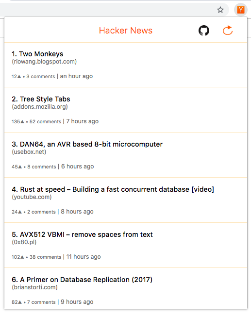

HackerNews-Feed
===============
  
   
  
Chrome and Firefox extension to have a quick peek at the top posts on Hacker news. Hacker News is the most popular news site in the tech industry and one of the top choices for new product releases.    
  
Currently using the unofficial HN api [node-hnapi](http://node-hnapi.herokuapp.com/).  

## Download
[Chrome](https://chrome.google.com/webstore/detail/hackernewsfeed/gnbcehahhollgehdncegnjcoflocfghb)  
[Firefox](https://addons.mozilla.org/en-US/firefox/addon/hackernews-feed/)
